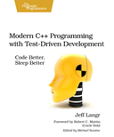

```
Roberto Nogueira  BSd EE, MSd CE
Solution Integrator Experienced - Certified by Ericsson
```

# Modern C++ Programming with TDD



## Table of Contents

```
Foreword 
Introduction
[ ] But Can It Work for Me On My System?
[ ] Who This Book is For
[ ] What You’ll Need
[ ] How to Use this Book
[ ] About “Us”
[ ] About Me
[ ] About the C++ Style in this Book
Global Setup
[ ] Test-Driven Development: A First Example excerpt
[ ] Set Up
[ ] The Soundex Class
[ ] Getting Started
[ ] Fixing Unclean Code
[ ] Incrementalism
[ ] Fixtures and SetUp
[ ] Thinking and TDD
[ ] Limiting Length
[ ] Dropping Vowels
[ ] Doing What It Takes To Clarify Tests
[ ] Testing Outside the Box
[ ] Refactoring to Single Responsibility Functions
[ ] Finishing Up
[ ] What Tests Are We Missing?
[ ] Our Solution
[ ] The Soundex Class
[ ] Tear Down
Test-Driven Development Foundations
[ ] Set Up
[ ] Unit Test and TDD Fundamentals
[ ] The TDD Cycle: Red-Green-Refactor
[ ] The Three Rules of TDD
[ ] Getting Green on Red
[ ] Mindsets for Success
[ ] Mechanics for Success
[ ] Tear Down
Test Construction
[ ] Set Up
[ ] Organization
[ ] Fast Tests, Slow Tests, Filters, and Suites
[ ] Assertions
[ ] Inspecting Privates
[ ] Testing vs. Test-Driving: Parameterized Tests and Other Toys
[ ] Tear Down
Test Doubles excerpt
[ ] Set Up
[ ] Dependency Challenges
[ ] Test Doubles
[ ] A Hand-Crafted Test Double
[ ] Improving Test Abstraction When Using Test Doubles
[ ] Using Mock Tools
[ ] Alternate Dependency Injection Techniques
[ ] Design Will Change
[ ] Strategies for Using Test Doubles
[ ] Miscellaneous Test Double Topics
[ ] Tear Down
Incremental Design
[ ] Set Up
[ ] Simple Design
[ ] Where Is the Up-Front Design?
[ ] Refactoring Inhibitors
[ ] Tear Down
Quality Tests
Set Up
Tests Come FIRST
[ ] One Assert Per Test
[ ] Test Abstraction
[ ] Tear Down
Legacy Challenges
Additional TDD Concepts and Discussions
[ ] Alternate Approaches
[ ] Triangulation
[ ] The TPP
[ ] Performance
[ ] Integration Testing
[ ] Threading
Growing and Sustaining TDD
[ ] Set Up
[ ] Explaining TDD to Non-Techies
[ ] The Bad Test Death Spiral, aka The SCUMmy Cycle
[ ] Pair Programming
[ ] Katas and Dojos
[ ] Using the Code Coverage Metric Effectively
[ ] Continuous Integration
[ ] Deriving Team Standards for TDD
[ ] Keeping up With the Community
[ ] Tear Down
Appendix A. Other C++ Unit Testing Tools
Appendix B. Code Kata: Roman Numeral Converter
[ ] Set Up
[ ] Let’s Go!
[ ] Practice Makes Perfect
[ ] Tear Down
Bibliography
```


